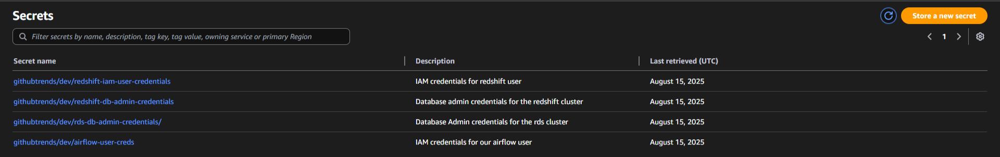

# Infrastructure - GitHub Trends Data Pipeline

Terraform code for provisioning all AWS resources required by the GitHub Trends ETL pipeline.

## Files

| File | Description |
|--|--|
| `providers.tf` | AWS provider setup |
| `backend.tf` | Remote backend configuration on S3 bucket |
| `variables.tf` | Variables for resource configuration |
| `vpc.tf` | VPC, subnets, routing configuration |
| `rds.tf` | AWS RDS (PostgreSQL) setup |
| `redshift.tf` | AWS Redshift cluster setup |
| `airflow_iam.tf` | IAM user for Airflow (This is needed because the extracted data is staged in S3 bucket) |
| `redshift_iam.tf` | IAM user for Redshift (Airbyte stages data in a S3 bucket before loading it to Redshift) |

## Secrets Management

Sensitive variables (e.g., DB credentials) are managed with AWS secrets manager

